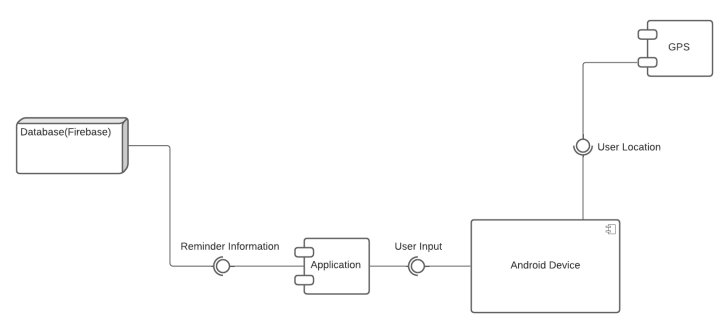
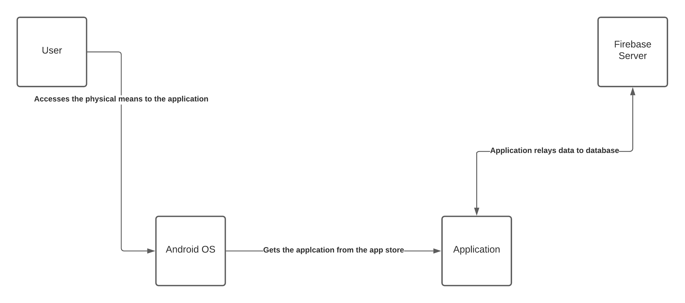
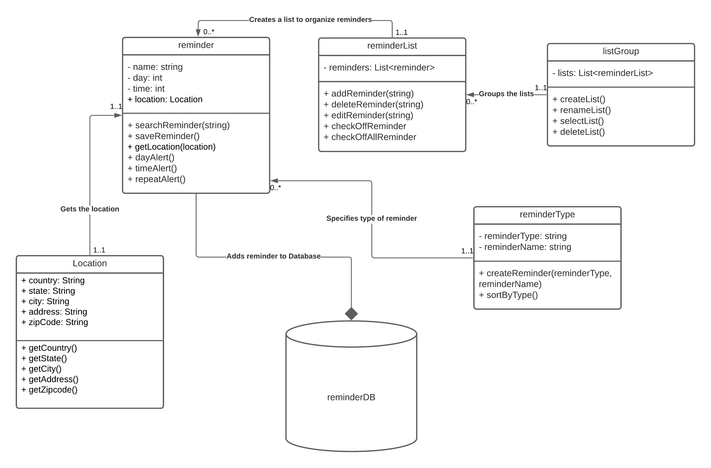
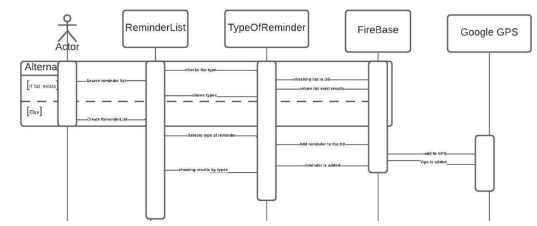
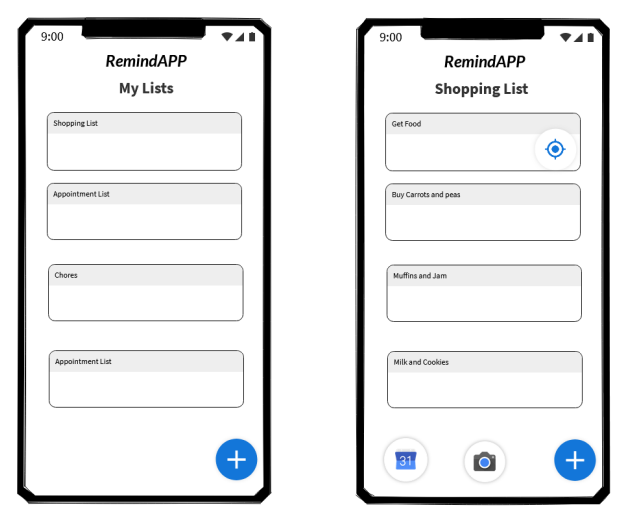

# Design Document

**Author**: Team 4

## 1 Design Considerations

### 1.1 Assumptions

We assume that we are programming for the Android OS platform, which we will be using Android studio.

### 1.2 Constraints

- Using a database to hold the reminder data
- The app should support different screen sizes
- The app should support many users using it at the same time
- The app should have a responsive UI

### 1.3 System Environment

The hardware that the user will interact with is on an Android phone or tablet (as we are coding this in Android).

The software the user will be interacting with is Android OS, from version 5.0 to the latest version, Android 12.

## 2 Architectural Design

### 2.1 Component Diagram

### 2.2 Deployment Diagram

The user accesses the application via their Android phone or tablet. Then the phone receives the data from the application and the application updates the information to the database server.

## 3 Low-Level Design

### 3.1 Class Diagram

<strong> We have used the Firebase database for our reminderDB, changed addReminder from reminderList into AddListActivity, removed deleteReminder from reminderList as the function EditListActivity serves the same role,changed saveReminder from reminder into EditReminderActivity.</strong>

### 3.2 Other Diagrams

## 4 User Interface Design

<strong>From our original design, we have moved the add button to the top right, changed our app name to RemindMe! and changed the design of our application.</strong>
