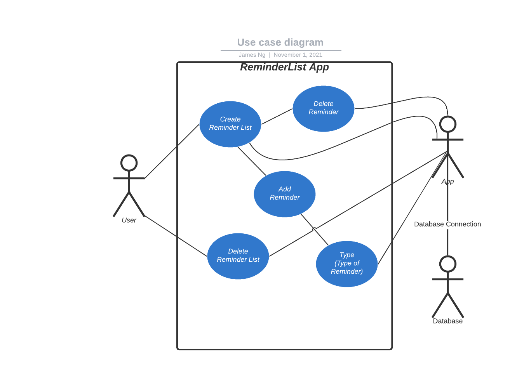

# Use Case Model

**Author**: Team 4

## 1 Use Case Diagram

## 2 Use Case Descriptions

Create Reminder List

- Requirements: Allows the user to create their own reminder list from the home page in the app
- Pre-conditions: Open the app
- Post-conditions: Allow users to add reminders
- Scenarios
  The user opens the app and there are no lists available. The user will add a reminder list to the app.
  The user opens the app and there are some lists available. There are no available lists the user wants to use and so will add a new list.

Add Reminder

- Requirements: Allows the user to add a reminder inside a specific list
- Pre-conditions: There must be a list made from Create Reminder List
- Post-conditions The user specifies what the type of reminder should be and has the option to set up a day and time alert. The reminder is added to a specific reminder type.
- Scenarios:
  The user creates a reminder list and places what reminders are inside
  The user searches for a reminder and creates a new reminder after specifying the type if no search result is present.

Delete Reminder List

- Requirements: The user selects the option to delete the reminder list
- Pre-conditions: The application must be open and user selects the delete option
- Post-conditions The application accesses the database and deletes the list.
  The user chooses to delete the reminder list and the application accesses the database.

Delete Reminder

- Requirements: Allows the user to delete a reminder from a specific reminder list.
- Pre-conditions: There must be a reminder in the reminder list.
- Post-conditions The reminder is no longer in the reminder list.
- Scenarios:
  The user wants to delete a reminder they no longer need from a reminder list.
  The user has multiple reminders that are the same.
  The user accidentally creates a reminder they don’t need.

Type

- Requirements: Allows the user to choose the type of reminder (ex. Event, Appointment, Task, etc)
- Pre-conditions: There must be a reminder that is being created at the same time the type of reminder is chosen.
- Post-conditions: The type of reminder is chosen and added to the database along with the reminder.
- Scenarios:
  1. The user wishes to select a type of reminder for their reminder
  2. The user wishes to add a type of reminder to an existing reminder
  3. The user wishes to change the type of reminder to an existing reminder
  4. The user wishes to delete the type of reminder they have chosen by unclicking the type of reminder they’ve chosen
