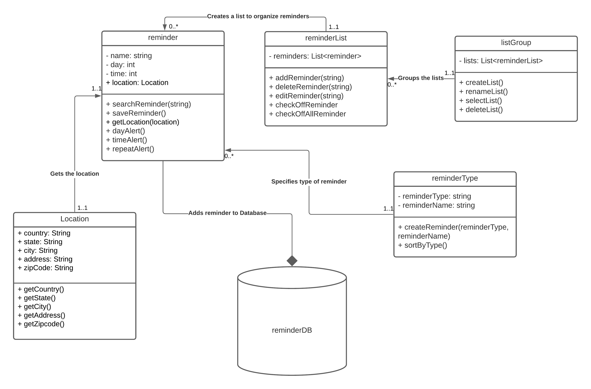

# Individual Design

# _Design 1_

## By AndrewLi25

Pros:

- Shows the relationship between each class

- Includes the multiplicity relationship between each class

Cons:

- Did not include reminder types

- Does not have a search function

- No method to group by type

# _Design 2_

## James-GPU

Pros:

- Each function serves a purpose in each class

Cons:

- Did not include attributes, only functions.

- Did not establish the correct relationships between classes.

- There is no multiplicity in this design

# _Design 3_

## Praloysaha66

Pros:

- Multiple users can create their account.

- User can search using product name in the database.

Cons:

- ProductItemType class could be included in the Product class.

- Repeats could be included in the reminder class.

# _Design 4_

## abdultani15

Pros:

- Operations to create reminders with different parameters

Cons:

- Did not include comments on the relationship lines.

- Repeated operations in different classes.

# _Design 5_

## umark7

Pros:

- Good overall design that covers all of the necessary requirements

- Multiplicity, functions, and relationships are well-portrayed throughout the design

- A cloud-based DB solution as mentioned would help the persistence of the app

Cons:

- Confusing methods and uses, should clean up the implementation of said methods

- App design might be difficult to implement, should work on the ease-of-use for functions and work to make the design have a MVP, then work on complexity from there

# _Team Design_

Main Commonalities:

We used correct representation of relationships between classes, multiplicity between each class, and added appropriate attributes.

Main Differences:

We specified location more in-depth than the majority of our designs. The team design is more compact yet holds all the necessary information.

The main design includes everything that made our designs unique and combined them together to compromise between our designs and styles.

# Summary

We have learned that each person has their own unique design choices and we learned to compromise between our opinions. We also learned how to divide the work efficiently so that the task may be completed quickly. We took our critique very well and the feedback was very helpful to the creator.
