# User Manual for RemindMe!

## By Team 4

### Welcome to RemindMe!

### This is the User Manual for RemindMe!

<h2>Reminder List Section</h2>
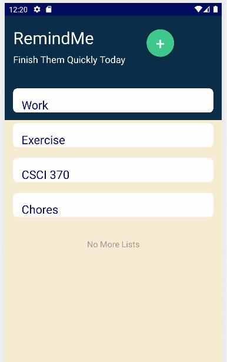

 This is the layout for the reminder lists!

    
Create new Reminder List

    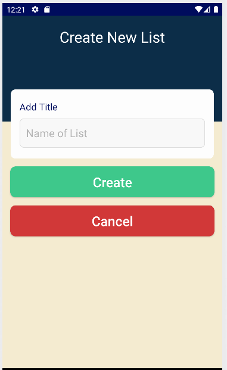
    
 This is where you are able to add your reminder list.

    

    
Add Title

    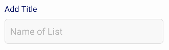
    
Add the title of your reminder list to specify what you would like to reminded of.

    

    

    
Create Button

    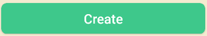
    
This button creates the lists.

    

    

    
Cancel Button

    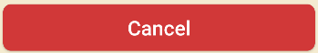
    
This button cancels any changes to the current list creation

    

---

    
Edit a Reminder List

    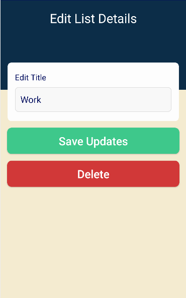
    <h3>To edit the reminder list, you <strong>hold down the specific list.</strong></h3>
    
This is where you are able to edit your reminder to your liking!

    

    
Edit Title

    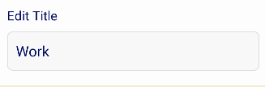
    
Edit the title of your reminder list to specify what you would like to reminded of.

    

    

    
Save Updates Button

    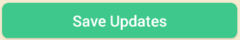
    
This button saves the changes made to the list.

    

    

    
Delete Button

    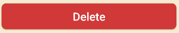
    
This button deletes the list.

    

---

<h2>Reminder Layout</h2>
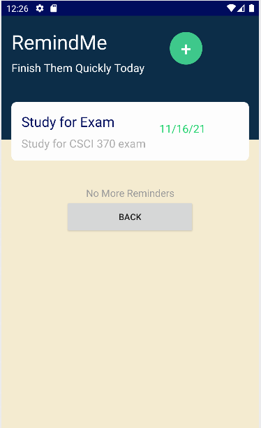

 This is the layout for the reminders!

    
Back Button 

    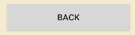
    
 This takes you back to the list section

---

    
Create a Reminder

    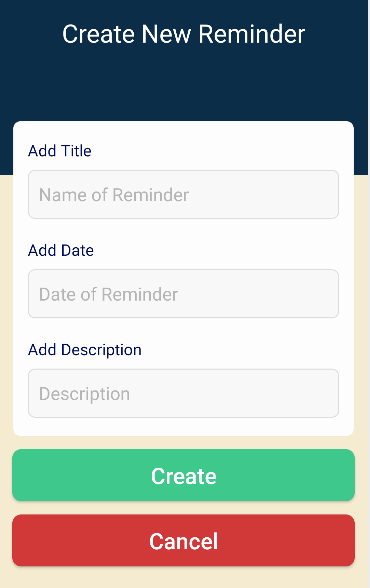
    
This is where you add your reminder to the list after pressing the green plus button.

    

    
Add Title

    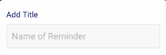
    
This area is the title of your reminder to specify what you would like to reminded of.

    

    

    
Add Date

    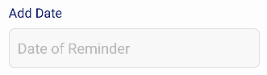
    
This area is to create the date of your reminder to specify when the reminder is due.

    

    

    
Add Description

    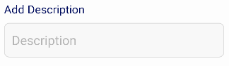
    
This creates the description of the reminder to give a detailed message to the reminder.

    

    

    
Create button

    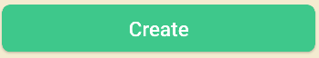
    
Press the green button to save any changes.

    

    

    
Cancel button

    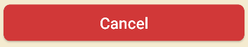
    
Press the cancel button to discard any changes.

    

---

    
Edit a Reminder 

    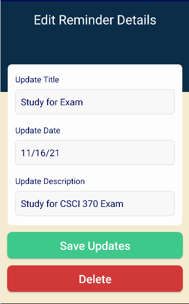
    
 This is where you are able to edit your reminder to your liking! 

    

    
Update Title

    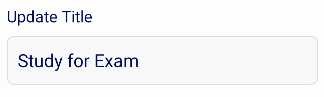
    
Edits the title of your reminder to specify what you would like to reminded of.

    

    

    
Update Date

    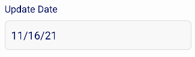
    
Edits the date of your reminder to specify when the reminder is due.

    

    

    
Update Description

    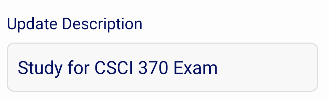
    
Adds the description of the reminder to give a detailed message to the reminder.

    

    

    
Save Updates Button

    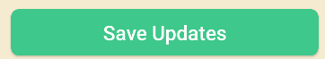
    
Press the update button to save any changes you have made to the reminder.

    

    

    
Delete Button

    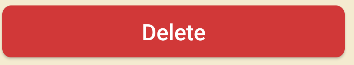
    
Press the delete button to delete the current reminder

    

